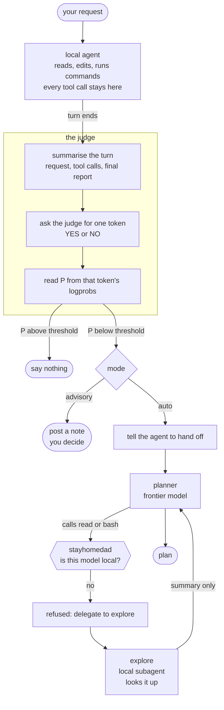

# stayhomedad

```
                  .---------------------.
                  |                     |__
                  |     W O R L D ' S   |  \
                  |                     |   |
                  |    O K A Y E S T    |   |
                  |                     |  /
                  |       D A D         |_/
                  |                     |
                  '---------------------'
                   \                   /
                    '-----------------'

        .-----------------------------------------.
        |   ()    [====]    //\\    (o)    |___|   |
        |_________________________________________|
                 the tools stay in here
```

*Does the job himself. Calls a professional when the pipe bursts.*


An [OpenCode](https://opencode.ai) plugin in two halves, both aimed at the same
thing: your frontier model should pay for conclusions, not for raw material.

- **The judge** scores every local turn with a one-token call and escalates
  only the ones that went badly.
- **The tool policy** stops an agent on a metered model from calling repo tools
  at all. It has to delegate to a local subagent and work from what comes back.

Either half works on its own. The tool policy is off until you turn it on.

## Why a judge

The usual way to make a local agent escalate is to write a rule in its prompt:
*"hand off when the task touches three or more files, or after two failed
attempts."* That asks the weakest model in the system to judge its own
competence, and it does not reliably comply. In the sessions that motivated
this plugin, a local model followed a mandated status-block rule in 1 turn out
of 48.

stayhomedad replaces that judgement with a measurement. A separate call, with no
history and no stake in the outcome, is asked whether the turn actually handled
the request. It may answer with exactly one token, so the answer's logprobs give
a usable probability rather than a coin flip. That number is the gate.

This is the confidence-cascade pattern: run the cheap model first, score the
result, escalate only on low confidence.

## Why a tool policy

Per-agent `permission` blocks in `opencode.json` already deny tools by agent
name. Two things go wrong with that. You have to remember to write the block
for every agent you add, and a frontier agent that *is* allowed to read will
read twenty files rather than ask for the one line it needs.

stayhomedad states the rule once, by provider: an agent whose model is not served
locally does not get `read`, `bash`, `grep`, `glob`, `edit`, `write` or
`apply_patch`. The refusal names the subagent to delegate to, so the model
recovers by itself on the next tool call rather than giving up. Everything else
stays open, including `task` and `question`, so the agent can still delegate
and still ask you something.

Local means a loopback or private-network `baseURL` in your OpenCode provider
config, plus the usual local provider names. When the provider cannot be
resolved at all, nothing is blocked.

## Install

```bash
npm install opencode-stayhomedad     # or: bun add opencode-stayhomedad
```

```jsonc
// ~/.config/opencode/opencode.json
{
  "plugin": ["opencode-stayhomedad"]
}
```

Requires OpenCode 1.18 or newer and any OpenAI-compatible local endpoint
(llama.cpp, vLLM, SGLang, Ollama, LM Studio).

## Configure

Inline options win over `~/.config/opencode/stayhomedad.json`, which wins over the
defaults. Restart OpenCode after changing either.

```jsonc
{
  "plugin": [["opencode-stayhomedad", { "mode": "auto", "threshold": 0.5 }]]
}
```

| Key | Default | Meaning |
|---|---|---|
| `threshold` | `0.45` | Escalate below this P(handled). |
| `mode` | `"advisory"` | `advisory` posts a note, `auto` hands off, `off` only logs. |
| `agents` | `["local"]` | Primary agents whose turns are judged. |
| `escalateTo` | `"planner"` | Subagent the judged agent is told to invoke. |
| `maxPerSession` | `3` | Cap on escalations per session. |
| `judgeUrl` | `null` | Pin a judge endpoint. Default follows the judged turn's own provider. |
| `judgeModel` | `null` | Pin a judge model, e.g. a small fast one. |
| `providerUrls` | `{}` | `{providerID: baseURL}` for providers OpenCode's config does not expose. |
| `judgeExtra` | thinking off | Merged into the judge request body. |
| `judgeSystem`, `judgeQuestion` | see `stayhomedad.example.json` | The judge prompt. |
| `tools` | off | Tool policy, below. |

### Tool policy

```jsonc
{ "tools": { "mode": "enforce", "delegateTo": "explore" } }
```

| Key | Default | Meaning |
|---|---|---|
| `mode` | `"off"` | `enforce` refuses the call, `warn` only logs, `off` does nothing. |
| `block` | the seven repo tools | Tool ids a remote agent may not call. |
| `delegateTo` | `"explore"` | Subagent named in the refusal. |
| `local` | common local provider ids | Extra providers to treat as local. |
| `remote` | `[]` | Providers always treated as remote, whatever their URL. |
| `exempt` | `[]` | Agent names that keep their tools anyway. |

The blocked agents need a way out, so give them the subagent and a local
subagent that can actually look things up:

```jsonc
"agent": {
  "planner":  { "permission": { "task": { "*": "deny", "explore": "allow" } } },
  "reviewer": { "permission": { "task": { "*": "deny", "explore": "allow" } } }
}
```

The judged agent needs permission to call `escalateTo`:

```jsonc
"agent": {
  "local": { "permission": { "task": { "*": "deny", "planner": "allow" } } }
}
```

## How it works



The judge is a separate call with no history and no stake in the outcome, which
is why its answer is worth more than the agent's own opinion of its work.

1. On `session.idle`, stayhomedad looks at the last user turn. Subagent sessions, its
   own injected messages, compaction turns, and agents outside `agents` are all
   skipped, and each turn is judged at most once.
2. It builds a compact transcript: the request, each tool call with truncated
   arguments and output, and the final response. Oldest tool calls are dropped
   first to stay under `summaryCap`.
3. It asks the judge for one token. With logprobs, P(yes) is the yes mass over
   the yes-plus-no mass. Without them, the YES/NO text is parsed and the score
   is 0 or 1.
4. Below `threshold`, it either posts an advisory note or instructs the agent to
   hand off. Every verdict is appended to `~/.local/state/opencode/stayhomedad.jsonl`.

A turn whose assistant message carries an error scores 0 without consulting the
judge.

The tool policy runs on a different hook and needs no judge. It resolves the agent for
the session, resolves that agent's provider, and throws on a blocked tool. The
model sees the refusal as an ordinary tool error and retries through `task`.
Blocks are appended to the same log with `"kind":"tools"`.

## Calibrate

Pick a threshold from your own history rather than trusting the default. The
script rescores past turns from OpenCode's database, read-only.

```bash
python3 scripts/calibrate.py            # judge each turn on the provider it ran on
python3 scripts/calibrate.py --url http://127.0.0.1:11435/v1 --limit 20
```

It prints one row per turn sorted by score, so you can see where the gap between
good turns and stuck ones falls. On the author's history that gap was wide, and
nothing at all landed in the middle:

```
  0.0                     0.45                      1.0
   ├───────────────────────┼────────────────────────┤
   ●●●●●●●●                │                 ●●●●●●●●
   │                       │                        │
   └ stuck, blocked,   threshold      answered it, ─┘
     gave up: ≤ 0.07                  finished it: ≥ 0.61
```

Pick your threshold inside your own gap. The default of 0.45 sits in the middle
of that one.

## Watch it

```bash
tail -f ~/.local/state/opencode/stayhomedad.jsonl
```

Each line records the score, the method (`logprobs` or `text`), the judge
endpoint and model, the action taken, and how long the judge took.

## Known behaviour

A well-argued *"this is infeasible, here is why"* scores low and triggers an
escalation. That is intended: a blocked task is exactly when a second opinion is
worth paying for. If you disagree, raise `threshold` or reword `judgeSystem`.

Text-only endpoints give a binary score, so `threshold` becomes a yes/no switch
rather than a dial. Prefer an endpoint with logprobs if you want to tune it.

## Test

```bash
bun test test/
```

The live judge test skips itself when no local endpoint is reachable.

## License

MIT
